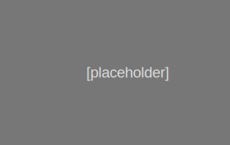

```{r setup, include=FALSE}
knitr::opts_chunk$set(echo = F)

library(rmarkdown)
yaml_front_matter("t_uploader.Rmd")


```

## Technologies

### Applications

- **Uploader**
  
  - Regions: Northeast
  - [App](https://shiny.iea-demo.us/uploader/)
  - [Code](https://github.com/marinebon/iea-uploader)
  - [Tutorial](https://www.youtube.com/watch?v=jpKv5PbBxq4)

### Dashboards

- 

### Infographics

- **Florida Keys**
  
  - Regions: Gulf of Mexico
  - [Website](https://shiny.iea-demo.us/uploader/)
  - [Code](https://github.com/marinebon/iea-uploader)

  
### Libraries

## Regions

### California Current

### Gulf of Mexico

### Northeast

## Layout

Will setup screenshot images per product and region with cards like so...

<div class="card-group">

<div class="card">
  
  <div class="card-body">
  <h5 class="card-title">Card title</h5>
  <p class="card-text">This is a wider card with supporting text below as a natural lead-in to additional content. This content is a little bit longer.</p>
  </div>
  <div class="card-footer">
  <small class="text-muted">Last updated 3 mins ago</small>
  </div>
</div>

<div class="card">
  
  <div class="card-body">
  <h5 class="card-title">Card title</h5>
  <p class="card-text">This card has supporting text below as a natural lead-in to additional content.</p>
  </div>
  <div class="card-footer">
  <small class="text-muted">Last updated 3 mins ago</small>
  </div>
</div>

<div class="card">
  
  <div class="card-body">
  <h5 class="card-title">Card title</h5>
  <p class="card-text">This is a wider card with supporting text below as a natural lead-in to additional content. This card has even longer content than the first to show that equal height action.</p>
  </div>
  <div class="card-footer">
  <small class="text-muted">Last updated 3 mins ago</small>
  </div>
  </div>
</div>

<br/>

