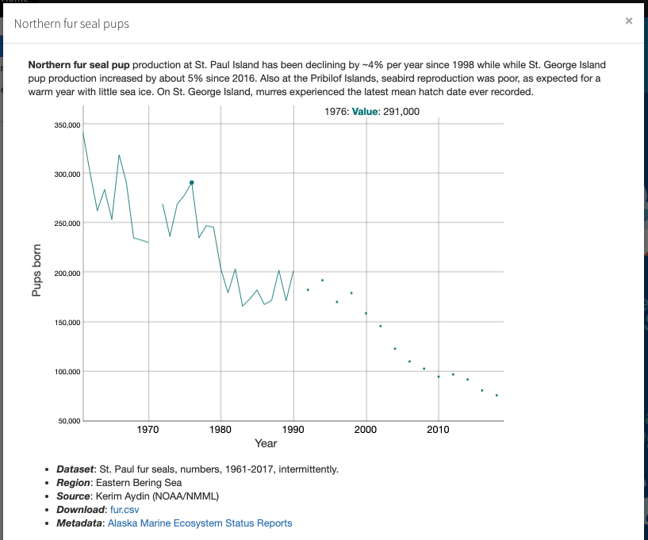

```{r setup, include=FALSE}
knitr::opts_chunk$set(echo = TRUE)

library(rmarkdown)
```


  - Regions: `r paste(params$Regions, collapse=',')`
  - [Website](`r params$website`)
  - [Code](`r params$code`)
  - [Video](`r params$video`)

## Details

So far, only the **Northern fur seal pup** icon is plotting a modal window:




