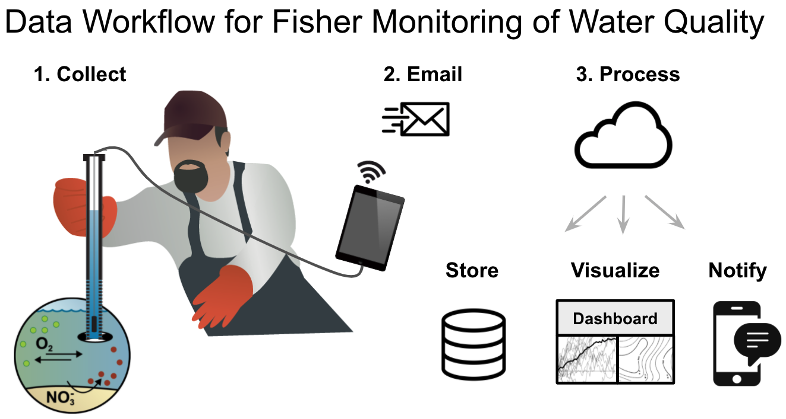

```{r setup, include=FALSE}
knitr::opts_chunk$set(echo = TRUE)

library(rmarkdown)
```


  - Regions: `r paste(params$Regions, collapse=',')`
  - [Website](`r params$website`)
  - [Code](`r params$code`)
  - [Video](`r params$video`)

## Details

This project was initiated by Chris Kelble to faciliate fisher monitoring for anoxic zones. I worked principally with postdoc Brendan Turley on this, but fisherman stopped collecting water quality from CTDs with covid lockdown. Here's an early illustration of the idealized process:




